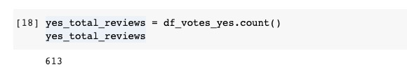
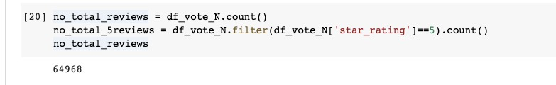
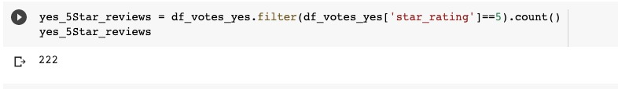
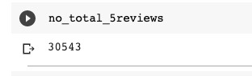

# Amazon_Vine_Analysis

## Overview of the analysis: 

The goal of the project was to review and analyze reviews on amazon for members of Vine program to check for any bias with ratings versus paid reviews. We extracted data and created different dataframes like customers , product, review and vine dataframe to aid our analysis

## Results: 

### How many Vine reviews and non-Vine reviews were there?

We have total of 613 vine reviews and 64,968 non vine reviews

### How many Vine reviews were 5 stars? How many non-Vine reviews were 5 stars? 

We found 222 5-star reviews out of 613 total vine reviews. We also observed 30543 5-star reviews out of 64968 for non vine reviews

### What percentage of Vine reviews were 5 stars? What percentage of non-Vine reviews were 5 stars?

36% of Vine reviews were 5 stars and 47% of non Vine reviews were 5 stars.

## Summary: 

From our analysis, there is no possibility of positive bias in the program. This is because we found 36percent of vine reviews are 5 stars, whereas 47% of non vine reviews were 5 stars. This helps to clarify that there is no bias towards vine paid reviews

For additional analysis, we can take a further deep dive to check other connected datasets or look at average ratings of paid versus unpaid reviews

